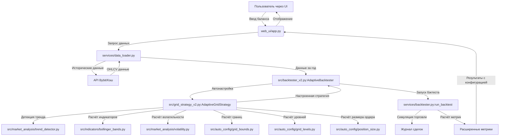

# Архитектура Grid Trading Bot v2.0

## 1. Обзор версии 2.0

Grid Trading Bot v2.0 представляет собой существенное расширение MVP v1.0 с добавлением **автоматической настройки параметров сетки** на основе анализа рынка. Основные улучшения:

- **Адаптивная стратегия** - автоматическая настройка границ, количества уровней и размера ордеров
- **Анализ рынка** - детекция тренда, расчёт волатильности, использование индикаторов
- **Расширенный бэктестер** - поддержка автонастройки и расширенные метрики
- **Модульная архитектура** - разделение на независимые компоненты для анализа и конфигурации

## 2. Структура директорий v2.0

```
.
├── config/                          # Конфигурация
│   └── settings.py                  # Настройки по умолчанию
├── models/                          # Базовые модели v1.0
│   ├── grid_strategy.py            # Базовая логика сетки
│   └── exchange_api.py             # Обёртка для API Bybit
├── services/                       # Сервисы v1.0
│   ├── backtester.py              # Базовый бэктестер
│   └── data_loader.py             # Загрузчик данных
├── src/                           # Новые компоненты v2.0
│   ├── grid_strategy_v2.py        # Адаптивная стратегия
│   ├── backtester_v2.py           # Расширенный бэктестер
│   ├── indicators/                # Технические индикаторы
│   │   ├── bollinger_bands.py     # Полосы Боллинджера
│   │   └── fractals.py            # Детектор фракталов
│   ├── market_analysis/           # Анализ рынка
│   │   ├── trend_detector.py      # Детектор тренда
│   │   └── volatility.py          # Калькулятор волатильности
│   └── auto_config/               # Автонастройка параметров
│       ├── grid_bounds.py         # Расчёт границ сетки
│       ├── grid_levels.py         # Расчёт уровней и шага
│       └── position_size.py       # Расчёт размера позиции
├── web_ui/                        # Веб-интерфейс
│   └── app.py                     # Streamlit приложение
├── tests/                         # Тесты
│   ├── test_integration_v2.py     # Интеграционные тесты v2.0
│   └── ...                        # Другие тесты
└── docs/                          # Документация
    ├── V2_ARCHITECTURE.md         # Этот файл
    ├── V2_USER_GUIDE.md           # Руководство пользователя
    └── ...
```

## 3. Ключевые компоненты v2.0

### 3.1. Модуль `src/indicators`

- **`BollingerBands`** (`src/indicators/bollinger_bands.py`):
  - Расчёт верхней, средней и нижней полос Боллинджера
  - Параметры: период (по умолчанию 24), стандартные отклонения (2.0)
  - Используется для определения границ сетки и волатильности

- **`FractalDetector`** (`src/indicators/fractals.py`):
  - Детекция фрактальных точек (верхних и нижних)
  - Используется для идентификации ключевых уровней поддержки/сопротивления

### 3.2. Модуль `src/market_analysis`

- **`TrendDetector`** (`src/market_analysis/trend_detector.py`):
  - Анализ тренда на основе скользящих средних
  - Определение режима рынка: `"UPTREND"`, `"DOWNTREND"`, `"RANGE"`
  - Влияет на стратегию размещения сетки

- **`VolatilityCalculator`** (`src/market_analysis/volatility.py`):
  - Расчёт исторической волатильности (стандартное отклонение логарифмических доходностей)
  - Используется для определения плотности уровней сетки

### 3.3. Модуль `src/auto_config`

- **`GridBoundsCalculator`** (`src/auto_config/grid_bounds.py`):
  - Автоматический расчёт верхней и нижней границ сетки
  - Учитывает режим рынка, полосы Боллинджера, текущую цену и волатильность

- **`GridLevelsCalculator`** (`src/auto_config/grid_levels.py`):
  - Оптимальное количество уровней сетки на основе волатильности и баланса
  - Расчёт шага сетки (расстояние между уровнями)

- **`PositionSizeCalculator`** (`src/auto_config/position_size.py`):
  - Расчёт размера ордера для каждого уровня
  - Учитывает баланс, количество уровней, режим рынка и текущую цену

### 3.4. Адаптивная стратегия (`src/grid_strategy_v2.py`)

- **`AdaptiveGridStrategy`** - наследуется от `GridStrategy`:
  - Автоматическая настройка всех параметров через метод `auto_configure()`
  - Поддержка fallback-конфигурации при ошибках
  - Хранение параметров конфигурации для анализа

**Процесс автонастройки:**
1. Детекция режима рынка (`TrendDetector`)
2. Расчёт полос Боллинджера
3. Расчёт волатильности
4. Определение границ сетки
5. Расчёт количества уровней
6. Расчёт шага сетки
7. Определение размера ордера

### 3.5. Расширенный бэктестер (`src/backtester_v2.py`)

- **`AdaptiveBacktester`** - наследуется от `Backtester`:
  - Поддержка автонастройки через `run_with_auto_config()`
  - Расширенные метрики с информацией о конфигурации
  - История конфигураций для сравнения
  - Fallback-режим при ошибках

## 4. Поток данных v2.0



## 5. Взаимодействие компонентов

### 5.1. Последовательность вызовов

1. **Инициализация**:
   ```python
   backtester = AdaptiveBacktester(initial_balance=10000, use_auto_config=True)
   ```

2. **Автонастройка**:
   ```python
   results = backtester.run_with_auto_config(
       daily_data=daily_df,
       intraday_data=intraday_df,
       fee_rate=0.0006
   )
   ```

3. **Внутренний процесс**:
   - Создание `AdaptiveGridStrategy`
   - Вызов `auto_configure()` с передачей данных
   - Последовательный вызов всех калькуляторов
   - Обновление параметров стратегии
   - Запуск стандартного бэктеста

4. **Возврат результатов**:
   - Стандартные метрики (PnL, Sharpe Ratio, Max Drawdown)
   - Информация о конфигурации (режим, границы, уровни)
   - Аналитические метрики (ROI на инвестиции, использование капитала)

### 5.2. Константы и параметры

**Ключевые константы в автонастройке:**
- `TREND_THRESHOLD = 0.02` - порог для определения тренда
- `BB_PERIOD = 24` - период для полос Боллинджера
- `BB_STD_DEV = 2.0` - стандартные отклонения
- `VOLATILITY_PERIOD = 30` - период для расчёта волатильности
- `MIN_LEVELS = 10`, `MAX_LEVELS = 50` - ограничения количества уровней
- `MIN_POSITION_SIZE = 0.0001` - минимальный размер ордера в BTC

## 6. Совместимость с v1.0

### 6.1. Обратная совместимость

- **`AdaptiveGridStrategy`** наследуется от `GridStrategy`:
  - Все методы базового класса доступны
  - Можно использовать как обычную стратегию с ручными параметрами

- **`AdaptiveBacktester`** наследуется от `Backtester`:
  - Поддерживает оба режима: автонастройка и ручная конфигурация
  - При `use_auto_config=False` работает идентично v1.0

### 6.2. Миграция с v1.0 на v2.0

1. **Импорт новых классов**:
   ```python
   # Вместо from models.grid_strategy import GridStrategy
   from src.grid_strategy_v2 import AdaptiveGridStrategy
   
   # Вместо from services.backtester import Backtester
   from src.backtester_v2 import AdaptiveBacktester
   ```

2. **Использование автонастройки**:
   ```python
   # Старый код (v1.0)
   strategy = GridStrategy(upper_bound=55000, lower_bound=45000, ...)
   backtester = Backtester(initial_balance=10000)
   results = backtester.run_backtest(data, strategy)
   
   # Новый код (v2.0) - автонастройка
   backtester = AdaptiveBacktester(initial_balance=10000, use_auto_config=True)
   results = backtester.run_backtest(data)  # Автоматическая настройка
   ```

3. **Ручная настройка (совместимость)**:
   ```python
   # v2.0 с ручными параметрами (как v1.0)
   strategy = AdaptiveGridStrategy(
       upper_bound=55000,
       lower_bound=45000,
       num_levels=20,
       amount_per_level=0.001,
       deposit=10000
   )
   backtester = AdaptiveBacktester(initial_balance=10000, use_auto_config=False)
   results = backtester.run_backtest(data, strategy)
   ```

## 7. Обработка ошибок и fallback-механизмы

### 7.1. Уровни отказоустойчивости

1. **Ошибки анализа рынка**:
   - При ошибке детекции тренда используется режим `"RANGE"`
   - При ошибке расчёта индикаторов используются консервативные значения

2. **Ошибки автонастройки**:
   - Метод `auto_configure()` возвращает fallback-конфигурацию
   - Консервативные параметры: ±10% от текущей цены, 15 уровней

3. **Ошибки бэктеста**:
   - `AdaptiveBacktester` имеет метод `_run_fallback_backtest()`
   - Возвращает базовые метрики с пометкой `fallback_mode=True`

### 7.2. Логирование

Все компоненты v2.0 используют модуль `logging`:
- `INFO` - основные этапы работы
- `WARNING` - не критичные проблемы, использование fallback
- `ERROR` - критические ошибки, требующие внимания

## 8. Тестирование

### 8.1. Типы тестов

1. **Unit-тесты**:
   - Тестирование отдельных калькуляторов (`test_auto_config.py`)
   - Тестирование индикаторов (`test_indicators.py`)
   - Тестирование анализа рынка (`test_market_analysis.py`)

2. **Интеграционные тесты**:
   - Полный пайплайн автонастройки (`test_integration_v2.py`)
   - Совместимость с v1.0 (`test_integration.py`)

3. **Функциональные тесты**:
   - Проверка работы UI с новыми функциями (`test_ui.py`)
   - Тестирование обработки ошибок (`test_error_handling.py`)

### 8.2. Запуск тестов

```bash
# Все тесты v2.0
pytest tests/test_integration_v2.py -v

# Все тесты проекта
pytest -v

# С покрытием кода
pytest --cov=src --cov-report=html
```

## 9. Расширяемость архитектуры

### 9.1. Добавление новых индикаторов

1. Создать класс в `src/indicators/`
2. Реализовать метод `calculate()`
3. Интегрировать в `AdaptiveGridStrategy.auto_configure()`

### 9.2. Добавление новых режимов рынка

1. Расширить `TrendDetector.detect_trend()`
2. Добавить логику обработки в `GridBoundsCalculator`
3. Обновить `PositionSizeCalculator` для нового режима

### 9.3. Кастомизация параметров

Все ключевые параметры вынесены в константы классов:
- Изменение порогов тренда
- Настройка периодов индикаторов
- Корректировка ограничений (мин/макс уровней)

## 10. Производительность и оптимизация

### 10.1. Кэширование

- Исторические данные кэшируются в `DataLoader`
- Результаты расчёта индикаторов могут кэшироваться
- Сессионное состояние в Streamlit UI

### 10.2. Оптимизации вычислений

- Векторизованные операции с pandas
- Минимизация повторных расчётов
- Ленивая инициализация ресурсоёмких компонентов

### 10.3. Память

- Очистка промежуточных данных
- Использование генераторов для больших наборов данных
- Оптимизация хранения истории сделок

---

*Документ создан: 2025-12-18*  
*Версия: 2.0.0*  
*Следующее обновление архитектуры: при добавлении новых модулей или значительных изменений*